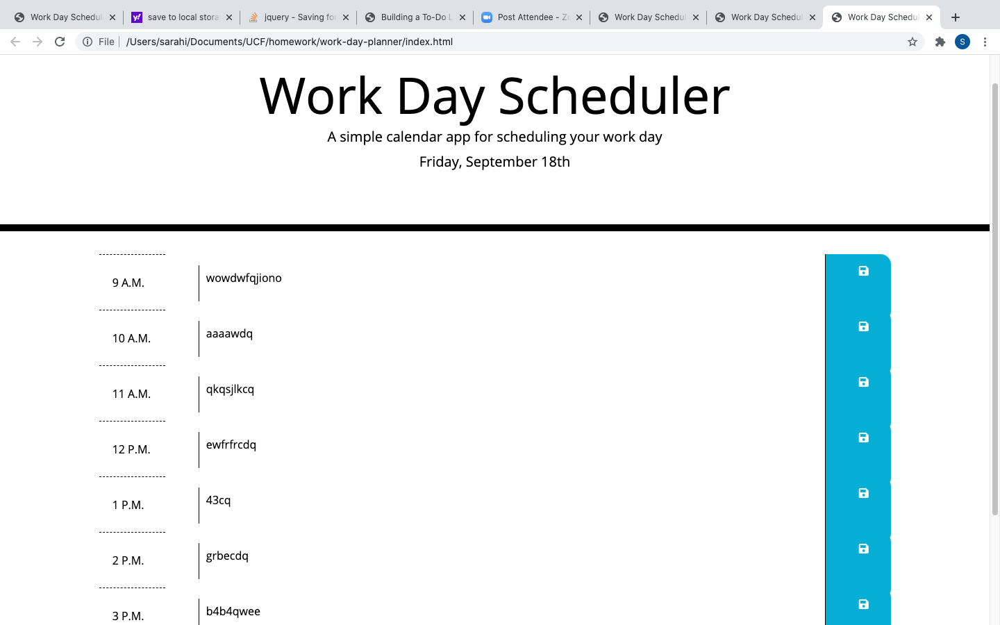

# work-day-planner

## Description 

This application is a planner that helps originize your nine to five workday. There is a heading on the top of the page displaying the current date. You are able to add notes to every hour staring at 9am all the way to 5pm. The hour you are currently on will be shown in red. All future hours will be colored green. Lastly, all past hours will be grayed out. Once you add notes to your planner you can save them for future refrence. All notes saved will displayed on the planner itself.

## Installation

There are no installations required. With the github link it will simply display in the browser.

 https://irasar.github.io/work-day-planner/

## Usage 

Provide instructions and examples for use. Include screenshots as needed. 

## Credits

List your collaborators, if any, with links to their GitHub profiles.

If you used any third-party assets that require attribution, list the creators with links to their primary web presence in this section.

If you followed tutorials, include links to those here as well.

## License

The last section of a good README is a license. This lets other developers know what they can and cannot do with your project. If you need help choosing a license, use [https://choosealicense.com/](https://choosealicense.com/)

---

🏆 The sections listed above are the minimum for a good README, but your project will ultimately determine the content of this document. You might also want to consider adding the following sections.

## Badges

Badges aren't _necessary_, per se, but they demonstrate street cred. Badges let other developers know that you know what you're doing. Check out the badges hosted by [shields.io](https://shields.io/). You may not understand what they all represent now, but you will in time.

## Contributing

If you created an application or package and would like other developers to contribute it, you will want to add guidelines for how to do so. The [Contributor Covenant](https://www.contributor-covenant.org/) is an industry standard, but you can always write your own.

## Tests

Go the extra mile and write tests for your application. Then provide examples on how to run them.

---
© 2019 Trilogy Education Services, a 2U, Inc. brand. All Rights Reserved.

