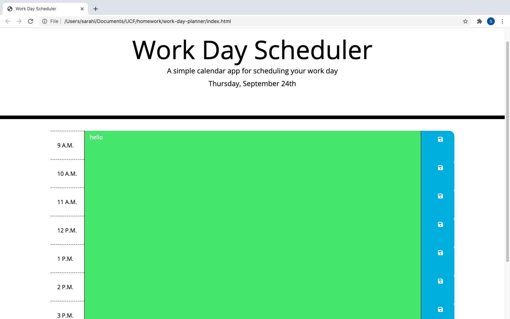

# work-day-planner

## Description 

This application is a planner that helps originize your nine to five workday. There is a heading on the top of the page displaying the current date. You are able to add notes to every hour staring at 9am all the way to 5pm. The hour you are currently on will be shown in red. All future hours will be colored green. Lastly, all past hours will be grayed out. Once you add notes to your planner you can save them for future refrence. All notes saved will displayed on the planner itself.

## Installation

There are no installations required. With the link, it will simply display in the browser.

 https://irasar.github.io/work-day-planner/

## Usage 

